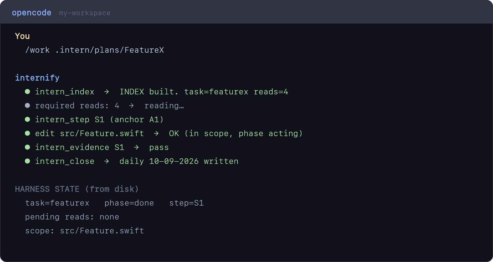

# internify-ai

**A disk-backed engineer loop for AI agents.** Context lives on disk, not in the
model's head — so agents stop hallucinating and stop losing grounding across
sessions and compactions.

The repository is **internify-ai**; the tool/CLI is **internify**. internify is
the generalized, portable form of a harness that already runs in production as
the `/work` command: it boots a session, indexes a spec, enforces layered gates,
and records evidence.

> Status: v1. Works today with **opencode** (adapter) and any tool via the
> **CLI**. Unit + smoke tests included.

---

## Table of contents

- [Why](#why)
- [How it works](#how-it-works)
- [Walkthrough: from zero](#walkthrough-from-zero)
- [Repository layout](#repository-layout)
- [Quick start](#quick-start)
- [CLI (any tool)](#cli-any-tool)
- [Spec structure](#spec-structure)
- [Tools](#tools)
- [Contract](#contract)
- [Articles](#articles)
- [License](#license)

---

## Why

Agents hallucinate when they carry too much state in memory: too much context
overload → drift → invented files, APIs, and behavior. internify moves the
context **out of memory and onto disk**, then re-injects it every turn. It also
blocks unsafe actions until the agent is properly grounded.

## How it works

```
Boot → Index → Read → Step → Edit → Evidence → Close → Daily
```

- **Boot** — collect session context (rules, latest daily, active task, specs)
  and write it to `state/CONTEXT.md`.
- **Index** — scan a spec folder, resolve referenced files, hash them, and build
  an `INDEX.md`. The agent cannot invent paths.
- **Gates** — layered checks block edits:
  1. **Read** — must read the required files first.
  2. **Scope / step** — must declare a step and stay within allowed files.
  3. **Anchor** — the step anchor must be declared by a plan step (status `ok`).
  4. **Bash** — shell writes must be scoped (or use `edit` / `write`).
  5. **Evidence** — cannot close a task without passing evidence per step.
- **Close** — validate evidence and append the daily log.

All working state lives under `.intern/state/` and is re-injected from disk each
turn. New session or compaction → no loss of grounding.

## Walkthrough: from zero

Set up internify in an empty workspace, with your project cloned next to it.


Then every work session runs the same enforced loop:


Inside opencode, the agent drives the same loop through `/work`:



(The clips are illustrative transcripts; the underlying output is real.)

## Repository layout

```
internify-ai/
├── README.md
├── CONTRACT.md              ← the stable contract (schemas, actions, gates)
├── LICENSE
├── core/                    ← tool-agnostic logic (pure, tested)
│   ├── lib/                 ← markdown, types, state, config, index-builder,
│   │                          gates, context, io, boot (+ *.test.ts)
│   ├── cli.ts               ← the tool-agnostic CLI
│   └── smoke.ts             ← end-to-end simulation
├── adapters/
│   └── opencode/            ← plugin + skill + command for opencode
│       ├── plugins/intern-harness.ts
│       ├── skills/intern-context/SKILL.md
│       ├── command/work.md
│       └── package.json
├── template/                ← scaffolded into a target project
│   ├── AGENTS.md
│   └── .intern/
│       ├── rules.md
│       ├── roles/
│       ├── plans/_template/SpecName/{SPECmd,Plan,Task}.md
│       └── daily/
└── article/                 ← design + portability + publishing notes
```

## Quick start

### From an empty workspace (opencode)

```bash
mkdir my-workspace && cd my-workspace

# 1. Clone your project and the tool, side by side
git clone git@github.com:you/my-project.git
git clone git@github.com:ajihairi/internify-ai.git

# 2. Scaffold the knowledge dir from the template
cp -r internify-ai/template/.intern   .intern
cp    internify-ai/template/AGENTS.md AGENTS.md

# 3. Install the adapter's deps
(cd internify-ai/adapters/opencode && bun install)

# 4. Tell opencode to load the adapter plugin
cat > opencode.json <<'JSON'
{
  "$schema": "https://opencode.ai/config.json",
  "plugin": ["./internify-ai/adapters/opencode/plugins/intern-harness.ts"]
}
JSON

# 5. Restart opencode, then start a session
```

The plugin resolves `../../../core/lib` relative to its own file, so keep
`internify-ai` where you cloned it (or adjust the plugin path).

### Optional: project beside the tool (Mode B)

If your project lives in a subfolder — or you want a non-standard knowledge dir —
add `internify.json` at the workspace root:

```json
{
  "knowledge": "intern",
  "plansDir": "superpowers/plans",
  "target": "my-project"
}
```

- `target` — where the project code lives (edits are scoped here).
- `knowledge` — where rules/roles/plans/daily/state live.
- `plansDir` — plans folder, relative to `knowledge` (default `plans`).

### Inspecting the core

```bash
cd internify-ai
(cd adapters/opencode && bun install)   # dev deps for adapter tests
bun test core/lib adapters/opencode
bun core/smoke.ts
```

## CLI (any tool)

The same loop is available as a CLI, so tools other than opencode (or a human)
can use it:

```bash
bun core/cli.ts boot
bun core/cli.ts index .intern/plans/FeatureX
bun core/cli.ts read src/Feature.swift     # print + mark a required read
bun core/cli.ts step S1 slice-1
bun core/cli.ts gate edit src/Feature.swift # exit 1 if blocked
bun core/cli.ts gate bash "echo x > src/Feature.swift" # exit 1 if blocked
bun core/cli.ts evidence S1 --claim wired --proof "read:1" --result pass
bun core/cli.ts close
```

`INTERNIFY_ROOT` overrides the workspace root (default: cwd). `<root>/internify.json`
(`{ "target": "…", "knowledge": "…" }`) separates the project from the knowledge
dir (Mode B). See [`docs/DESIGN.md`](./docs/DESIGN.md) for the design.

## Spec structure

One feature = one folder, always containing three files:

```
.intern/plans/<SpecName>/
├── SPECmd.md     ← WHAT
├── Plan.md       ← HOW
└── Task.md       ← WHO
```

A spec folder is the unit of work. Start it with `/work <spec-folder>`.

## Tools

Registered by the opencode adapter:

| Tool | What it does |
|------|--------------|
| `intern_boot` | Collect session context → write `CONTEXT.md` |
| `intern_index` | Scan a spec folder → build `INDEX.md`, start/resume a task |
| `intern_context` | Return a minimal slice (one section / one function) |
| `intern_step` | Declare the active step + anchor |
| `intern_evidence` | Append a proof record for a step |
| `intern_close` | Validate evidence, append daily log, finish |
| `intern_status` | Show current phase + ledger |
| `intern_override` | One-shot, recorded gate bypass (escape hatch) |

Disable the harness with `INTERN_HARNESS=off`.

## Contract

See [`CONTRACT.md`](./CONTRACT.md). It defines the file schemas, the 8 actions,
the 3 gates, and the folder layout. Keep it stable and you can swap tools without
rewriting the workflow.

## Articles

- [Design](./docs/DESIGN.md)
- [01 — What we built](./article/01-what-we-built.md)
- [02 — Portability](./article/02-portability.md)
- [03 — Publishing](./article/03-publishing.md)
- [04 — internify workspace model](./article/04-internify-workspace.md)

## Author

Maintained by **Hamzhya Salsatinnov Hairy**.

## License

MIT — see [`LICENSE`](./LICENSE).
